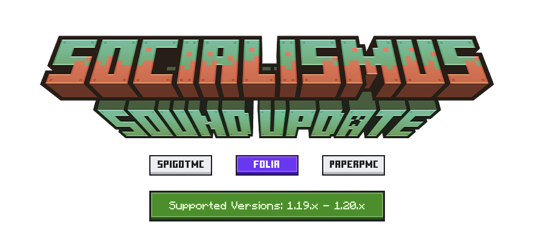
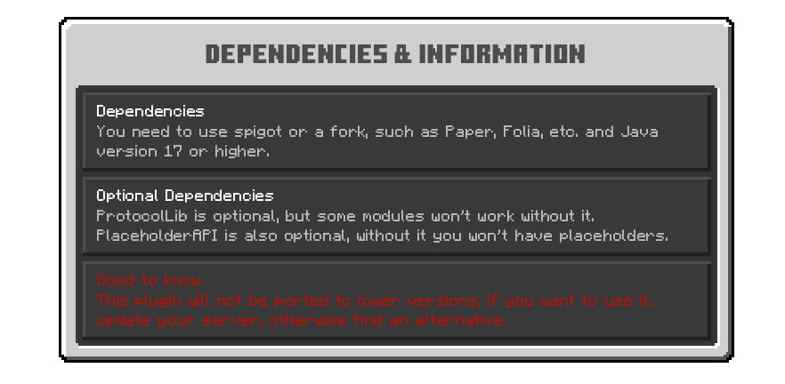

# TODO List:

- [ ] Automatic Moderation (regex filtering and external APIs)
- [ ] Chat Bot (if message matches conditions then send a message)
- [ ] Colorization (allow to choose a color for each chat/bubble)
- [ ] Features as external modules
- [ ] Folia Support
- [ ] Item/Inventory Display Chat
- [ ] MultiPaper Support
- [ ] Placeholders
- [ ] Statistics
- [ ] Swapper Update (placeholder list command, customize suggestions)
- [ ] Tag Parser
- [ ] Sounds everywhere (when you click on a message, when you receive a message, etc.)
- [ ] User Click Action (execute command, open url, send action bar)
- [ ] Velocity Support
- [x] Chats <sup>From 0.0.1
- [x] Swapper <sup>From 0.1.0
- [x] Bubble Chat <sup> From 0.2.0
- [x] Chats Improvement: Symbol or command chat <sup> From 1.0.0
- [x] Private Messages <sup> From 1.0.0
- [x] Message Announcer <sup> From 1.1.0
- [x] API <sup> From 1.2.0
- [x] User Mention <sup> From 1.2.0

# Using the API

If you need help using the API, you can PM me on Discord (whereareiam) or on [Telegram](https://whereareiam.t.me/). You
can also read
the [Javadocs](https://javadoc.jitpack.io/com/github/whereareiam/Socialismus/api/latest/javadoc/index.html).

To use the plugins API, you need to add JitPack to your repository and add the dependency to your project.

## Maven

```xml

<repositories>
    <repository>
        <id>jitpack.io</id>
        <url>https://jitpack.io/</url>
    </repository>
</repositories>
```

```xml

<dependencies>
    <dependency>
        <groupId>com.github.whereareiam.Socialismus</groupId>
        <artifactId>api</artifactId>
        <version>VERSION</version>
        <scope>provided</scope>
    </dependency>
</dependencies>
```

## Gradle

```groovy
repositories {
    maven { url 'https://jitpack.io' }
}
```

```groovy
dependencies {
    implementation 'com.github.whereareiam.Socialismus:api:VERSION'
}
```

**For versions, you can use the following: dev-SNAPSHOT or any version from the releases page (for example 1.2.0).**

## Getting the plugin instance

To get the plugin instance, you need to use the following code:

```java
SocialismusAPI api = SocialismusAPI.getInstance();
```

# Statistics


  